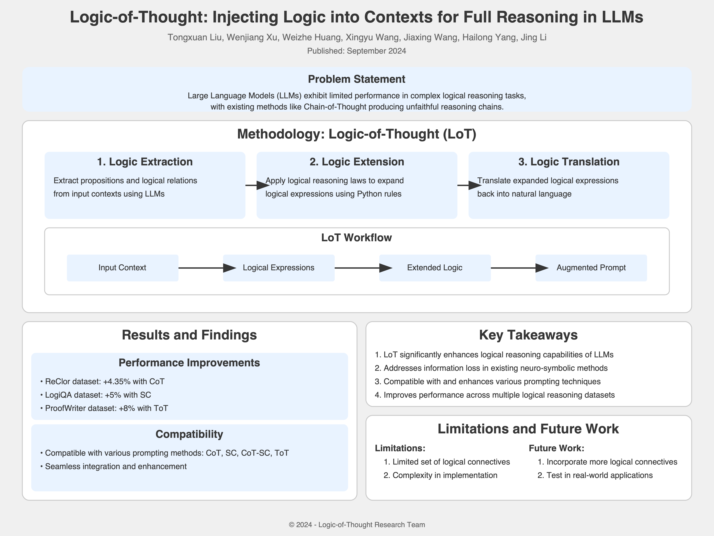

# PoC code of riddle solver inspired by "Logic-of-Thought: Injecting Logic into Contexts for Full Reasoning in Large Language Models"

Tongxuan Liu, Wenjiang Xu, Weizhe Huang, Xingyu Wang, Jiaxing Wang, Hailong Yang, Jing Li

Blog post <https://paperwithoutcode.com/logic-of-thought-injecting-logic-into-contexts-for-full-reasoning-in-large-language-models-it-is-smarter-than-openai-o1/>

The paper “Logic-of-Thought: Injecting Logic into Contexts for Full Reasoning in Large Language Models” introduces the Logic-of-Thought (LoT) method, which significantly enhances logical reasoning capabilities by integrating first-order logic into the input contexts of Large Language Models (LLMs). This advancement addresses the limitations of existing methodologies such as Chain-of-Thought (CoT), Tree-of-Thoughts (ToT), and Graph-of-Thoughts (GoT), which often suffer from information loss and unfaithful reasoning chains. LoT employs a three-phase approach: Logic Extraction, Logic Extension, and Logic Translation, ensuring logical relationships are accurately captured and preserved. Extensive experiments demonstrate notable performance improvements, such as a 4.35% gain on the ReClor dataset when integrated with CoT. The method’s compatibility with various prompting techniques, including CoT, SC, and ToT, makes it a versatile augmentation tool. This paper is worth reading for its innovative methodology, robust empirical validation, and significant implications for enhancing logical reasoning in LLMs, making it a valuable resource for researchers aiming to improve the accuracy and reliability of AI in complex reasoning tasks. Future research could explore expanding logical connectives, improving logic extraction techniques, and testing the method’s applicability in real-world scenarios. This blog shows its implementation using GPT-4o-mini on solving an interesting riddle puzzle which tricked OpenAI o1 for a wrong answer.

Challenge yourself on this question: (original content from <https://edcraft.io/blog/all-articles/5-zebra-puzzles-for-kids>)

**Puzzle #4. Granny’s Birthday**

Granny Simpson’s birthday is coming soon. The rest of the family have prepared gifts for her, many of them at the same time! Granny will have a birthday show, bouquets from everyone, and many tasty things for her anniversary.

What gifts will Granny receive? Read the tips and find out the answer!

Conditions of the puzzle:

The Simpsons are preparing a concert show with tricks, a guitar song, and one family member’s own poem.
* A person who wrote the poem will give a bread machine as a present and buy irises.
* Mummy will buy tulips.
* Melanie has learned to bake cinnamon buns and remembered guitar chords for Granny’s birthday.
* The trickster has prepared a notebook for recipes and a fruit salad.
* Melanie knows that Granny likes daisies.
* A person who will give a rocking chair will also prepare homemade candies for Granny.
* Bill has a special deck of cards and a box with a double bottom.
* Mummy and Melanie have had rehearsals for two for a week.
* Daddy will prepare orange juice.
* Granny will also be given a bouquet of roses and a ticket to the theatre play.

Who will give a theatre ticket and who will buy roses?