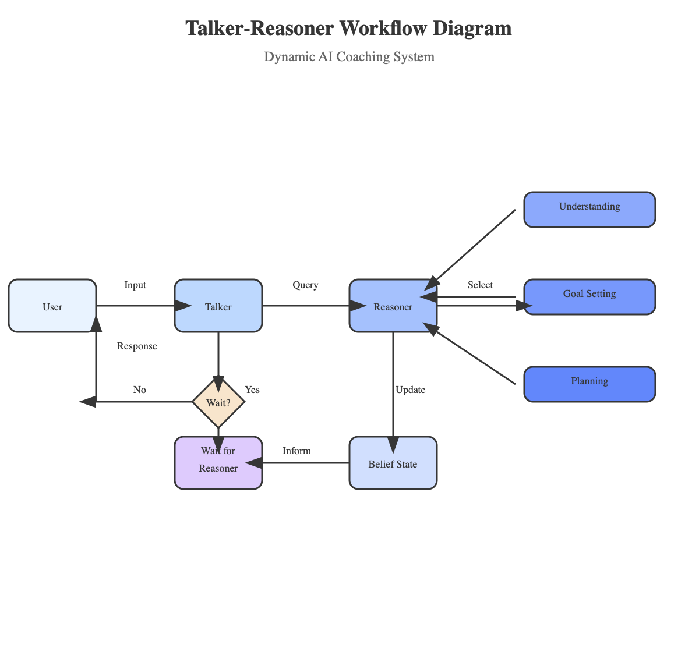
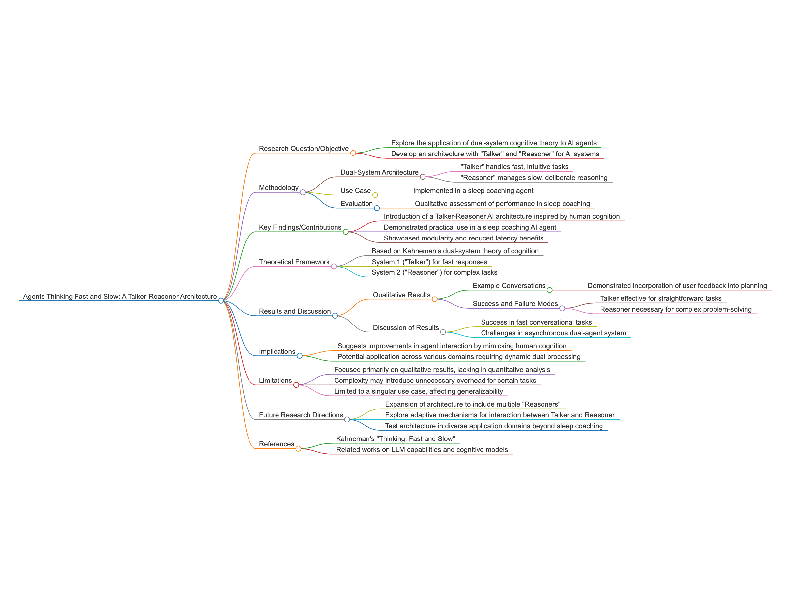

# Sleep coach agent code for "Agents Thinking Fast and Slow: A Talker-Reasoner Architecture"

Konstantina Christakopoulou, Shibl Mourad, Maja Matarić

The paper “Agents Thinking Fast and Slow: A Talker-Reasoner Architecture” from Deepmind presents an innovative AI architecture inspired by Daniel Kahneman’s dual-system theory of human cognition, where tasks are divided between a “Talker” for fast, intuitive interactions and a “Reasoner” for slow, deliberate reasoning. This dual-system approach is pivotal for enhancing AI’s adaptability and performance, allowing seamless handling of both conversational and complex reasoning tasks. The practical implementation in a sleep coaching agent showcases the architecture’s relevance, effectively demonstrating its ability to mirror human cognitive processes. By separating tasks, the architecture promotes modularity and reduces latency, crucial for real-time applications demanding rapid responses. This work stands out due to its biologically inspired design and potential to redefine AI systems’ responsiveness and reasoning capabilities. The suggestion to introduce multiple specialized Reasoners opens further research avenues, aiming for more sophisticated and versatile AI systems. For researchers and graduate students, this paper is a valuable read as it bridges cognitive science with AI, offering a clear framework for implementing dual-system processing and highlighting a path towards more human-like AI interaction. The post implemented a sleep coach example to illustrate the hierarchy reasoner with a mechanism for the Talker to wait for the Reasoner in complex planning scenarios.

